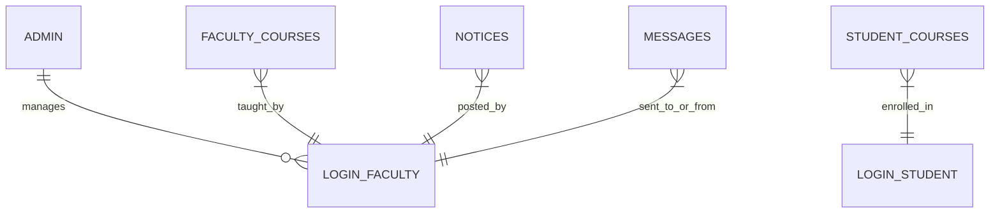

# 🎓 Student & Faculty Management System

A full-featured web-based **Student and Faculty Management System** built using **Java Servlets**, **JSP (JavaServer Pages)**, and **MySQL Database**. Designed with multi-role access control for **Administrators**, **Faculty Members**, and **Students**.

---

## 🚀 Features & Role Capabilities

### 🛡️ Administrator Role
* **Faculty Enrollment**: Register new faculty members with department, name, age, and login credentials.
* **Student Enrollment**: Register new students with roll number, department, name, and login credentials.
* **Directory Management**: View and inspect list of registered students and faculty members.
* **Profile Management**: Update admin profile details and profile avatar.
* **Default Admin Credentials**:
  * **Username**: `admin`
  * **Password**: `admin`

### 👨‍🏫 Faculty Role
* **Course Management**: View assigned courses and manage course registrations.
* **Attendance Management**: Set total lectures held and update attendance records per student.
* **Marks Management**: Upload and update academic marks for enrolled students.
* **Notice Board**: Upload announcement notices (with images) and delete old notices.
* **Student Chat**: Interactive messaging system to communicate directly with students.
* **Profile & Avatar**: Update account profile details, password, and avatar image.
* **Default Faculty Credentials**:
  * **Username**: `faculty`
  * **Password**: `faculty`

### 🎓 Student Role
* **Course Registration**: Browse available courses and register for subjects.
* **Academic Dashboard**: Check marks, course details, and attendance percentages.
* **Notice Viewer**: View campus notices and announcements posted by faculty.
* **Faculty Chat**: Send direct messages to faculty members.
* **Profile Management**: Update profile details, password, and avatar image.
* **Default Student Credentials**:
  * **Username**: `student`
  * **Password**: `student`

---

## 🛠️ Technology Stack

| Component | Technology / Library |
| :--- | :--- |
| **Backend** | Java Servlets (`javax.servlet-api`), JSP (JavaServer Pages) |
| **Database** | MySQL 8.0+ |
| **Database Driver** | MySQL Connector/J (`mysql-connector-java-8.0.30.jar`) |
| **File Handling** | Apache Commons FileUpload (`1.4`), Apache Commons IO (`2.11.0`) |
| **Server** | Apache Tomcat / GlassFish Application Server |
| **Build Tool** | Apache Ant (`build.xml`) / NetBeans IDE |
| **Frontend** | HTML5, CSS3 (`styles.css`), JavaScript |

---

## 🗄️ Database Architecture

The system utilizes two MySQL databases: `faculty_login` and `student_login`.



### Database 1: `faculty_login`
* **`admin`**: Stores admin credentials, age, and profile image path.
* **`login`**: Stores faculty user credentials (`username`, `password`, `fname`, `lname`, `department`, `age`).
* **`courses`**: Tracks courses linked to faculty members.
* **`notices`**: Contains notice image upload paths.
* **`messages`**: Stores incoming chat messages sent from students to faculty.

### Database 2: `student_login`
* **`login`**: Stores student credentials (`username`, `password`, `fname`, `lname`, `department`, `roll`).
* **`courses`**: Tracks course enrollment, total classes, attended classes, and marks per student.
* **`messagef`**: Stores messages sent from faculty to students.

---

## ⚙️ Setup & Installation

### 1. Prerequisites
* **Java Development Kit (JDK)**: JDK 8 or higher
* **Apache Tomcat**: Version 9.0 or 10.0 (or GlassFish Server)
* **MySQL Server**: Version 8.0 or higher
* **IDE**: NetBeans IDE (recommended), Eclipse, or IntelliJ IDEA

### 2. Database Configuration
1. Open your MySQL client (e.g., MySQL Workbench, Command Line, or phpMyAdmin).
2. Execute the included SQL script [`setup_db.sql`](file:///c:/Users/ADMIN/Documents/Student_Management_System/setup_db.sql):
   ```sql
   source /path/to/setup_db.sql;
   ```
3. Update MySQL connection credentials if necessary in [`src/java/com/db/DBConnection.java`](file:///c:/Users/ADMIN/Documents/Student_Management_System/src/java/com/db/DBConnection.java):
   ```java
   DriverManager.getConnection("jdbc:mysql://localhost:3306/" + dbName, "root", "YOUR_MYSQL_PASSWORD");
   ```

### 3. Build & Run
#### Option A: Using NetBeans IDE
1. Open NetBeans IDE and select **File -> Open Project**.
2. Select the project directory (`Student_Management_System`).
3. Add the required JAR files from [`lib/`](file:///c:/Users/ADMIN/Documents/Student_Management_System/lib) to the Project Libraries:
   - `mysql-connector-java-8.0.30.jar`
   - `javax.servlet-api-4.0.1.jar`
   - `commons-fileupload-1.4.jar`
   - `commons-io-2.11.0.jar`
4. Right-click the project and select **Clean and Build**.
5. Right-click the project and select **Run**.

#### Option B: Using Apache Ant
```bash
ant clean
ant compile
ant dist
```
Deploy the generated `.war` file located in the `dist/` directory to your Apache Tomcat `webapps/` folder.

---

## 📁 Project Structure

```
Student_Management_System/
├── build.xml                 # Apache Ant build script
├── setup_db.sql              # SQL setup script for MySQL databases
├── README.md                 # Project documentation
├── lib/                      # Required JAR libraries
│   ├── commons-fileupload-1.4.jar
│   ├── commons-io-2.11.0.jar
│   ├── javax.servlet-api-4.0.1.jar
│   └── mysql-connector-java-8.0.30.jar
├── nbproject/                # NetBeans project configuration files
├── src/java/                 # Java Servlets & Business Logic
│   ├── com/db/
│   │   └── DBConnection.java # Database connection helper class
│   ├── login.java            # Multi-role authentication servlet
│   ├── enrollFaculty.java    # Faculty registration servlet
│   ├── enrollStudent.java    # Student registration servlet
│   ├── courseRegister.java   # Course management servlet
│   ├── update_attendance.java# Attendance tracking servlet
│   ├── update_marks.java     # Marks tracking servlet
│   ├── upload_notice.java    # Notice posting servlet
│   ├── f_to_s.java           # Faculty to student messaging servlet
│   └── s_to_f.java           # Student to faculty messaging servlet
└── web/                      # JSP views & Web Assets
    ├── index.jsp             # Login & main landing page
    ├── admin_home.jsp        # Admin dashboard
    ├── faculty_home.jsp      # Faculty dashboard
    ├── student_home.jsp      # Student dashboard
    ├── chat_faculty.jsp      # Faculty messaging interface
    ├── chat_student.jsp      # Student messaging interface
    ├── styles.css            # Stylesheet
    └── images/               # Image assets & upload target directory
```

---

## 📝 License

This project is licensed under the terms available in the [`LICENSE`](file:///c:/Users/ADMIN/Documents/Student_Management_System/LICENSE) file.